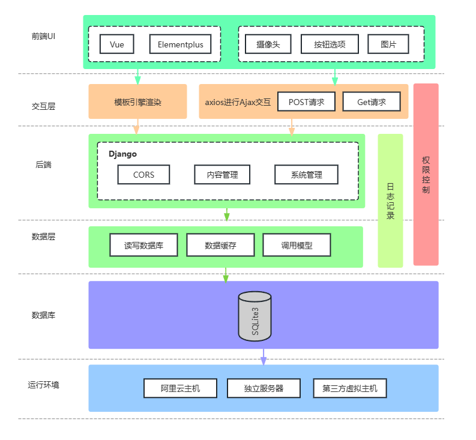

# 2021302181152 邓鹏 考勤打卡系统

## 实验环境

Anaconda3 + Jupyter + torch + matplotlib + tensorflow + Vue + Django + Kaggle

## 系统架构

## 模型一（自己实现）

## 数据集

[Large Crowdcollected Face Anti-Spoofing Dataset](https://www.kaggle.com/datasets/faber24/lcc-fasd/code)

## 模型二 （Github）

## 参考链接

https://github.com/AyuVirgiana/face-recognition-attendance-anti-spoofing

## 模型三 （Github）

## 参考链接

https://github.com/zeusees/HyperFAS

## 代码运行

- 前端 
`cd frontend` 
`npm install` 
`npm run dev`

- 后端 
`cd backend` 
`python manage.py makemigrations` 
`python manage.py migrate` 
`python manage.py runserver`

- 效果示例 
详见 `效果展示` 目录下的三个视频，由于涉及个人图片，故分享删除

- train_model 
该目录下的代码为我自己实现的模型的训练及测试代码